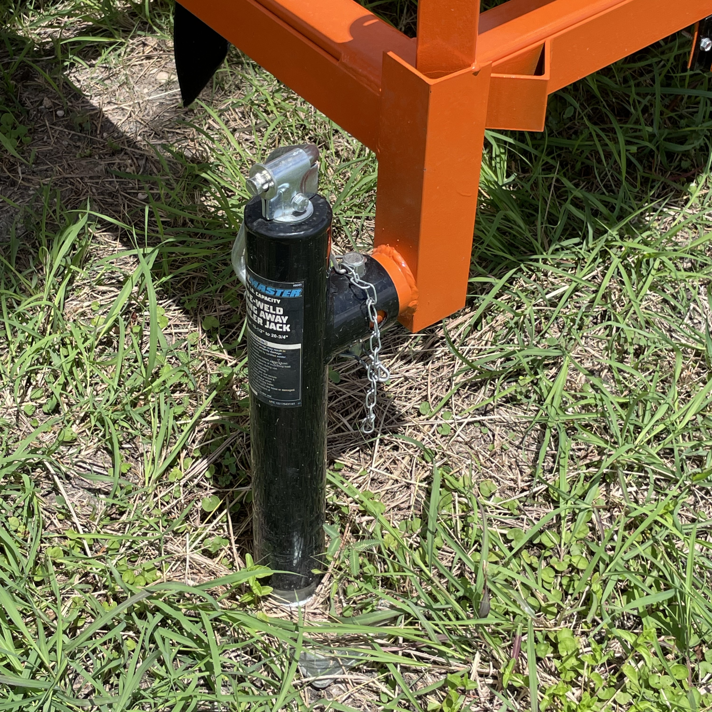
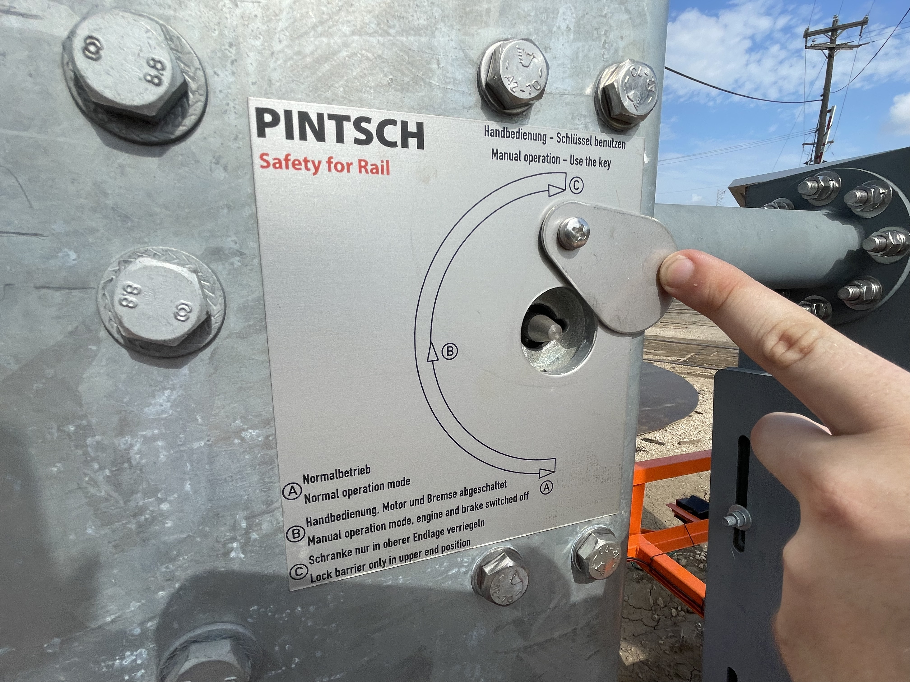
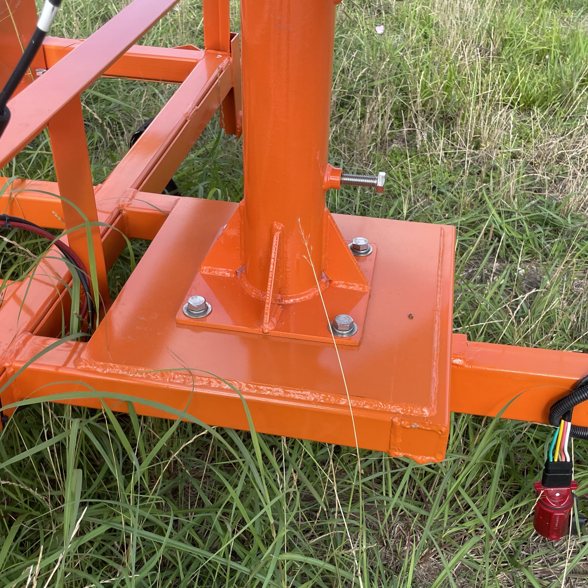
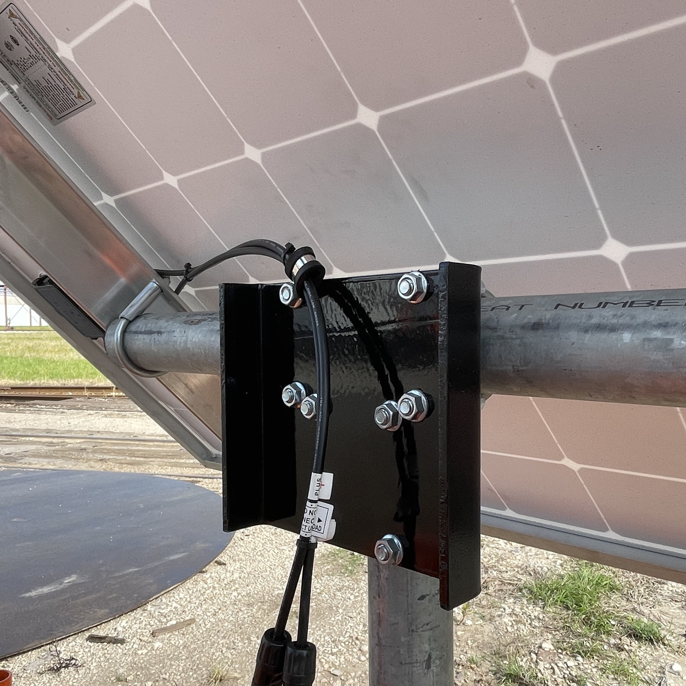

## 3.1 Trailer Setup

### Securing the Trailer

{: style="height:350px;width:350px"}

1. Park the trailer on level ground
2. Disconnect tow vehicle
3. Place wheel chocks in front of and behind the axle
4. Identify the 4 stabilizer jacks, each located at a corner of the trailer
5. Check the front-to-back level
6. Lower the rear jacks evenly until they barely touch the ground
7. Lower the front jacks so that the trailer is supported at all 4 corners
8. Check side-to-side level and fine tune adjustments if needed
9. Push on each corner and check wheel chocks to ensure stability

---

### Raising the Crossing Signal

1. Release the locking bolts from the signal mast
2. Carefully raise the mast into positon, using the side steps to prevent injury
4. Ensure the mast is fully seated
5. Bolt mast in upright positioon

---

## 3.2 Arm Setup

{: style="height:350px;width:350px"}

### Locking the Arm
1. Locate the gate locking tool stored in the mechanism enclosure
2. Identify the gate lock and slide the metal cover out of the way
3. Use the tool to turn the lock, securing the gate in the raised position

### Installing the Arm

1. Inspect the arm brackets on the gate mechanism for obstructions
2. Make sure the gate mechanism is locked in the raised (upright) position
3. Lift the Main Arm section into place
4. Insert and tighten the main bolts with the provided nut and washers
5. Insert the safety locking pin
6. If using an Arm Extension, slide it in to the main arm section to the desired length
7. Insert and tighten the arm extension bolts
8. Double check tightness of all bolts
9. Install and tighten Arm Lights

### Counterweighting the Arm

1. Slowly lower the arm manually (if possible) to check for smooth travel and balance
2. Adjust number of counterweight plates until the arm feels balanced
3. Check that counterweights are securely fastened

---

## 3.3 Solar Panel

{: style="height:350px;width:350px"}

### Positioning the Solar Panel

1. Determine which direction to face the solar panel to receive the most sun exposure given the trailer's surroundings (true south unless obstructed)
2. Identify which side of the trailer will receive more shade from the arm
3. Select the appropriate mounting plate on the sunniest, least shaded side of the trailer
4. Bolt the solar panel receptacle to the mounting plate

### Locking the Solar Panel

{: style="height:350px;width:350px"}

1. Locate the two rotation lock bolts on the solar panel receptacle
2. With the solar panel facing towards the sunniest angle, tighten the bolts to fix the panel in place
3. Adjust the inclination (15 to 40 degrees unless obstructed)
4. Tighten the inclination lock bolts
