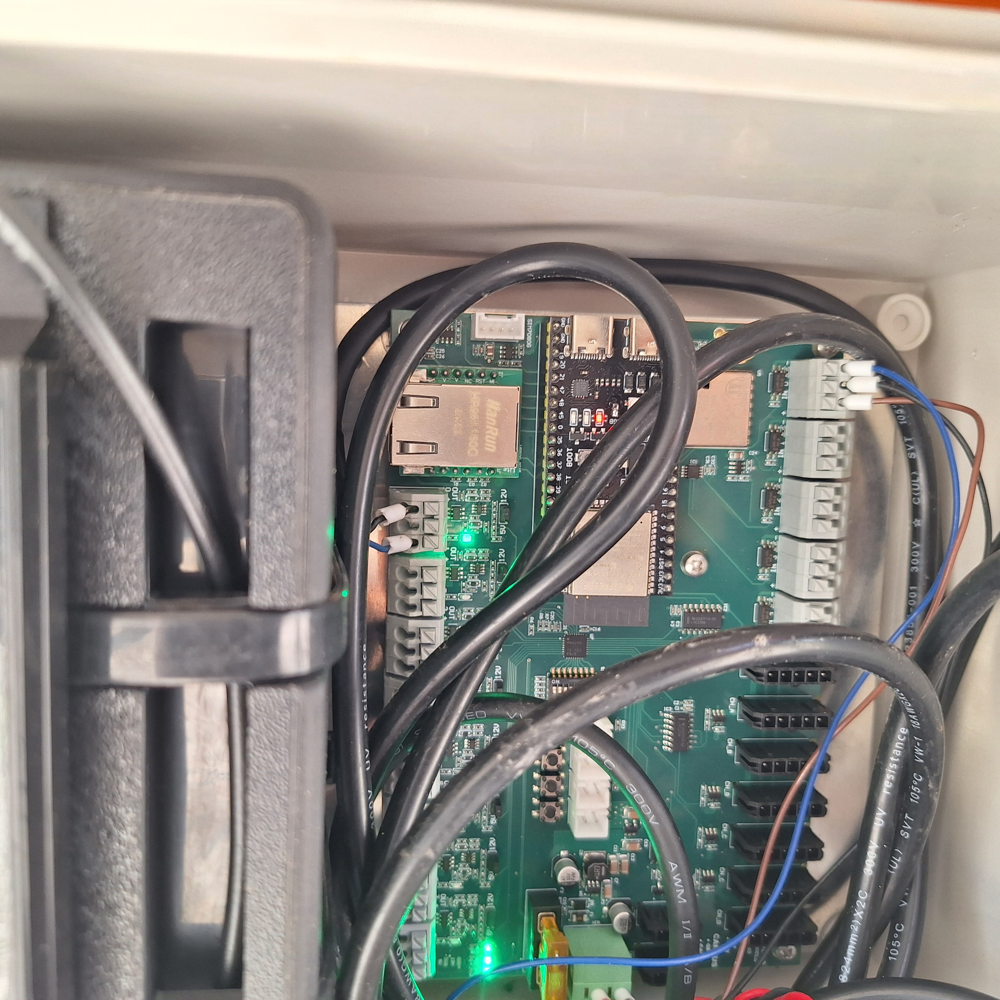
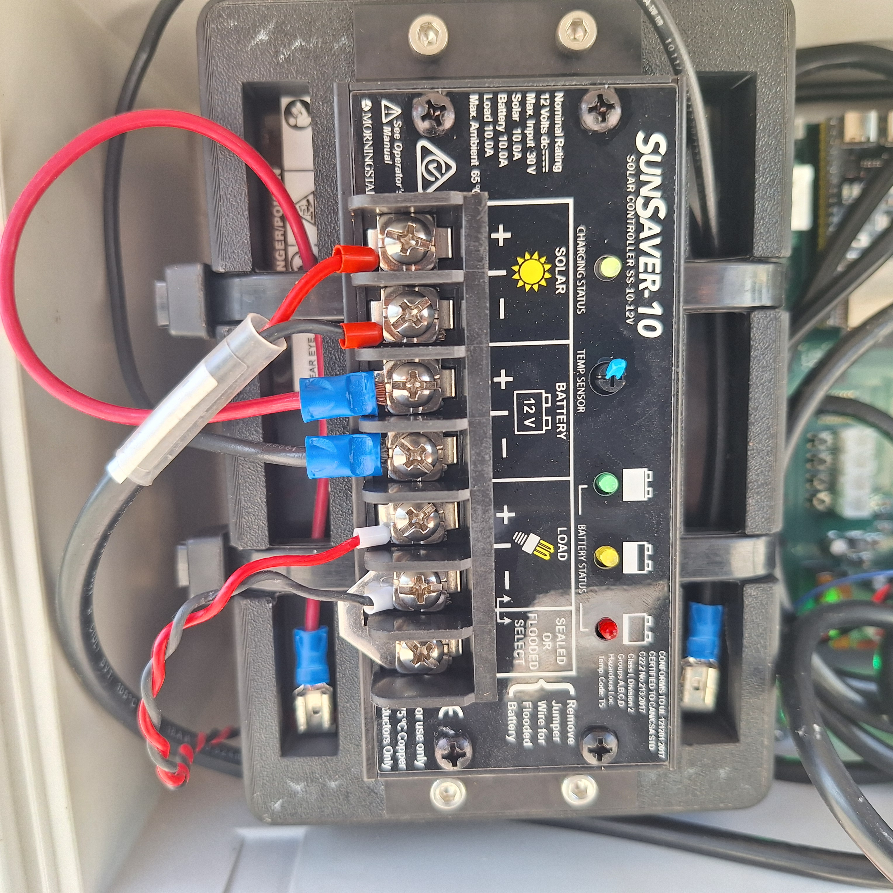
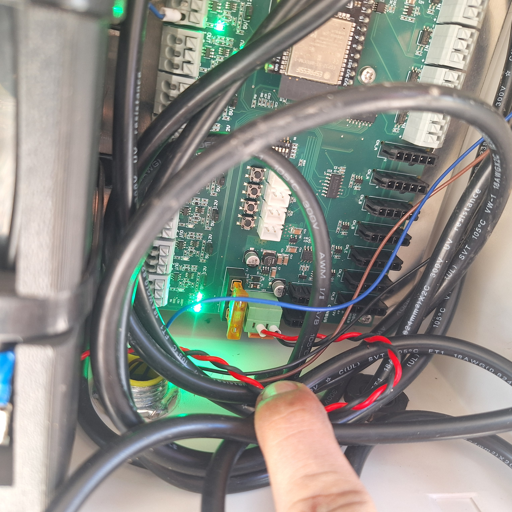

## 3.1 Derail Setup

### Before Install

1. Check clearance to adjacent rail, ensuring the following dimensions:

#### CLEARANCE
To rail: ``42 inches``

Vertical: ``27 inches``

Horizontal: ``22 inches``

{: style="height:350px;width:350px"}

### Positioning the Sensor

* Locate sensor bracket welded to derail device

> Bracket is previously installed. Mounting and welding instructions are not currently included within the scope of this document.

* Check that front of sensor is parallel to side face of derail device
* Slide the sensor in the slotted brack until it the face of the sensor is 3.5mm from the face of the derail

---

## 3.2 Controller Setup

{: style="height:350px;width:350px"}

### Mounting the Controller Stand

1. Mount the tie bracket to the tie
2. Clear area for controller stand
3. Bolt the controller stand to the tie bracket
4. Ensure bolts are tightened and assembly is secure

### Connecting the Sensor

{: style="height:350px;width:350px"}

1. Connect the sensor wires to terminals on the board as shown
2. Use a multimeter to test the connections

### Connecting the Solar Panel

{: style="height:350px;width:350px"}

1. Connect the Solar Panel wires to terminals on the board as shown
2. Use a multimeter to test the connections

### Connecting the Light

{: style="height:350px;width:350px"}

1. Ensure that 5V jumpers are installed
2. Connect the light wires to terminals on the board as shown
3. Use a multimeter to test the connections

---

## 3.3 Solar Panel Setup

{: style="height:350px;width:350px"}

### Solar Panel Rotation

1. Place the solar panel pipe receiver onto the corresponding threaded stud pattern
2. Add the 1/4" washers to the studs, on top of the pipe receiver
3. Without tightenining, loosely thread the 1/4"-20 nuts 
4. Rotate the solar panel so it faces south, or nearest direction recieving full sun
5. Ensure the light is not casting a shadow on the solar panel
6. Fully tighten down the 1/4"-20 nuts

### Solar Panel Tilt

1. Locate the bolts mounting the solar panel to the bracket
2. Loosen the bolts and tilt the solar panel to the desired angle for maximum sun
3. Tighten the bolts until they are secure
