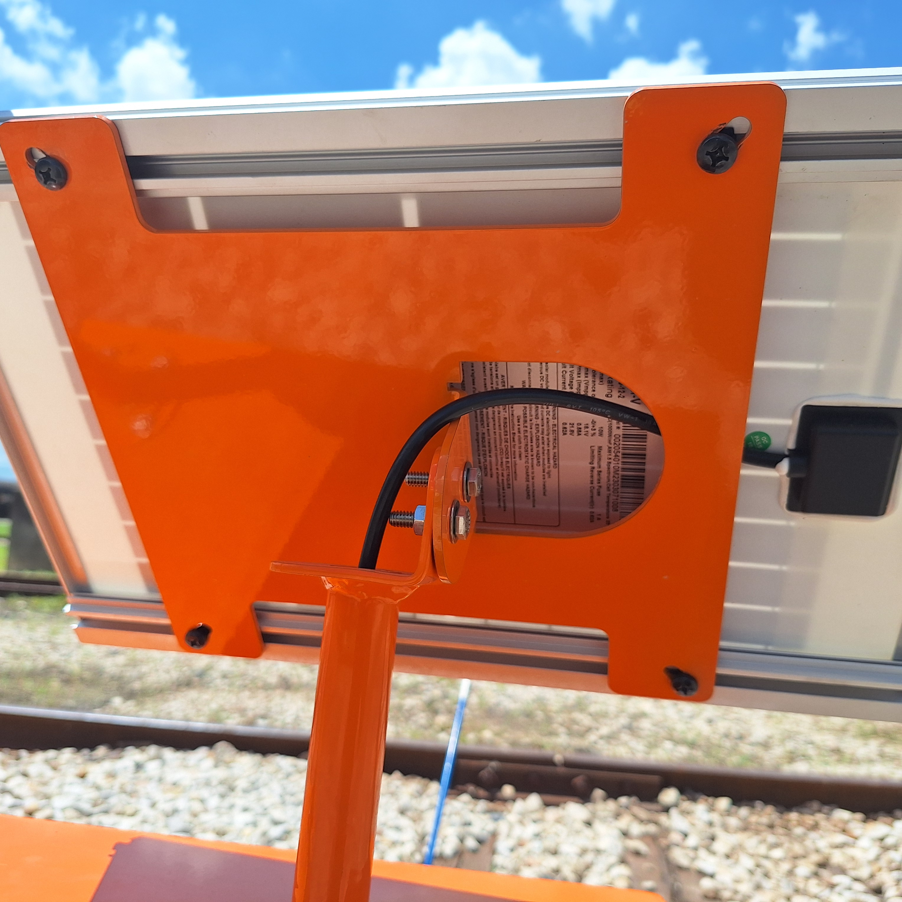

## 3.1 Derail Setup

{: style="height:350px;width:350px"}

### Positioning the sensor

* Locate the sensor bracket welded to the derail device

> Sensor bracket is previously installed. Mounting and welding instructions are not included in the scope of this document.

---

## 3.2 Controller Setup

{: style="height:350px;width:350px"}

### Mounting the controller

1. Mount the tie bracket to the tie
2. Bolt the controller stand to the tie bracket
3. Ensure controller stand is securely fastened to the tie with appropriate torque

### Connecting the sensor
* Connecting the solar panel
* Connecting the light

---

## 3.3 Solar Panel Setup

{: style="height:350px;width:350px"}

### Positioning the solar panel

1. Loosely bolt the solar panel to the pipe receiver bracket
2. Rotate the solar panel so it faces south. If south face is shaded than the 

### Locking the solar panel

1. 
