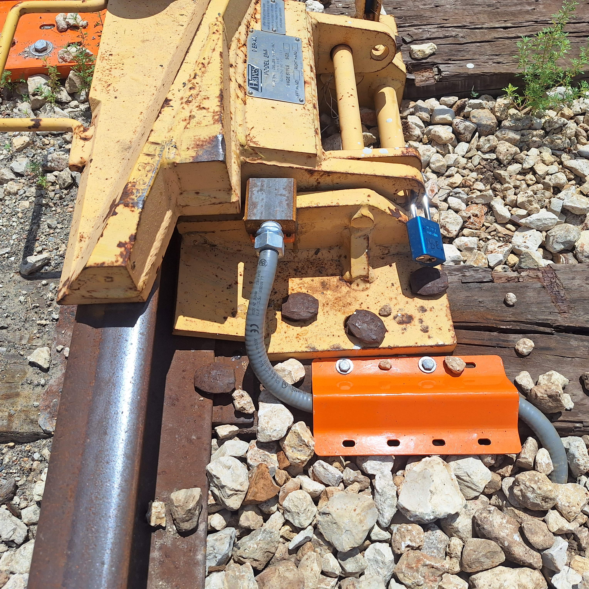
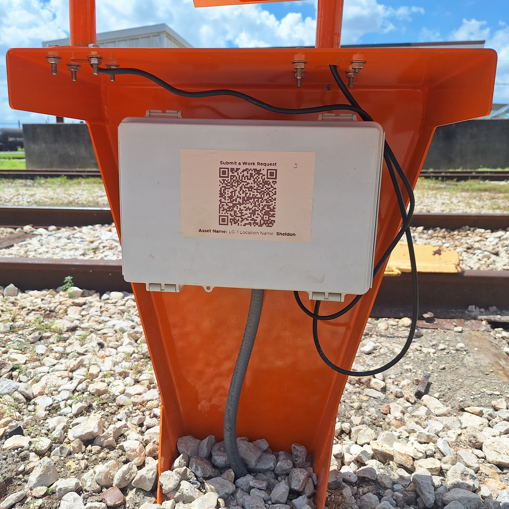

## 3.1 Site Preparation

### Clearance

Measure the area where the controller will be installed. Refer to the following figure and table for minimum clearance dimensions:

| To Rail   | Vertical   | Horizontal   |
|------------|------------|------------|
| 42 inches| 27 inches| 22 inches|

### Solar Panel

At the installation site, the sun should be directly visible from 10 AM - 3 PM, and not obstructed by structures, railcars, or foliage.

### Digging

Using a pickaxe, dig a path under the rail and around the sleepers for the liquid-tight tubing and controller stand.

---

{: style="height:350px;width:350px"}

## 3.2 Sensor Installation

### For Flip-Style Derail

1. Locate bracket on side of derail

2. Move derailer side to side, to the nearest and furthest extent, making sure sensor is clear of moving parts

3. Ensure sensor will be clear of wheels

4. Grind paint off of mating face of sensor bracket before welding

5. Weld sensor to derail 

### For Swing-Style Derail

1. Locate bracket on stand 

2. Bolt bracket to stand

### Liquid-Tight tubing

* Marmon provided

1. Measure between bracket to box

3. Cut tubing

5. Run cable through tubing from sensor to box

7. slide the bracket straight down on to the sensor

9. Move bracket forward and back to adjust

11. Once positioned, tighten top bolts to secure bracket

13. Connect sensor wire in box

---

## 3.3 Assembly

{: style="height:350px;width:350px"}

### Mounting the Controller Stand

1. Mount the tie bracket to the tie
2. Clear area for controller stand
3. Bolt the controller stand to the tie bracket
4. Ensure bolts are tightened and assembly is secure

### Connecting the Sensor

{: style="height:350px;width:350px"}

1. Connect the sensor wires to terminals on the board as shown
2. Use a multimeter to test the connections

### Connecting the Solar Panel

{: style="height:350px;width:350px"}

1. Connect the Solar Panel wires to terminals on the board as shown
2. Use a multimeter to test the connections

### Connecting the Light

{: style="height:350px;width:350px"}

1. Ensure that 5V jumpers are installed
2. Connect the light wires to terminals on the board as shown
3. Use a multimeter to test the connections

---

## 3.3 Solar Panel Setup

{: style="height:350px;width:350px"}

### Solar Panel Rotation

1. Place the solar panel pipe receiver onto the corresponding threaded stud pattern
2. Add the 1/4" washers to the studs, on top of the pipe receiver
3. Without tightenining, loosely thread the 1/4"-20 nuts 
4. Rotate the solar panel so it faces south, or nearest direction recieving full sun
5. Ensure the light is not casting a shadow on the solar panel
6. Fully tighten down the 1/4"-20 nuts

### Solar Panel Tilt

1. Locate the bolts mounting the solar panel to the bracket
2. Loosen the bolts and tilt the solar panel to the desired angle for maximum sun
3. Tighten the bolts until they are secure
