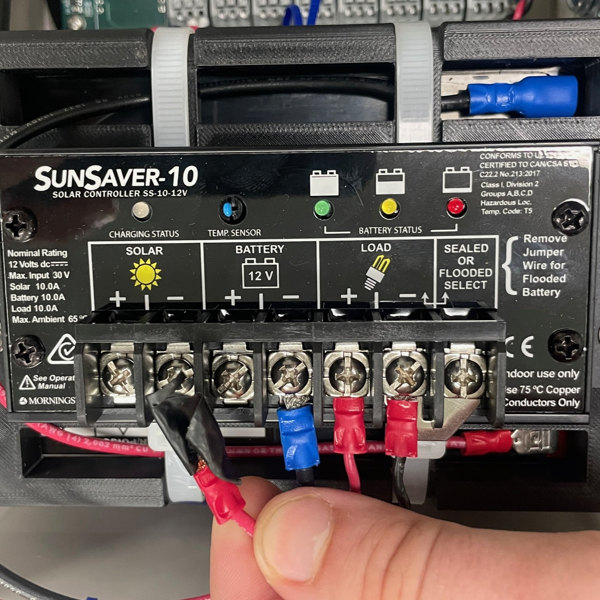

## 3.1 Site Preparation

Before beginning installation, confirm that all required tools and components are available. Site preparation must be completed before installing the derail system.

``⚠️ Do not install the device at any location that does not meet the clearance requirements.``

### Tools and Equipment

* Measuring Tape
* Tamping Pick or Pickaxe
* Multimeter
* Metric Allen Key Set
* Two Adjustable Wrenches
* 1/8" Slotted Screwdriver
* Utility knife (for cutting liquid-tight tubing)

### Clearance

The derail sensor requires a level installation surface and a clear zone around the device.

Minimum clearances:

Distance to rail: 42 in.

Vertical clearance: 27 in.

Horizontal clearance: 22 in.

The ground must be level front to back. From the rail to a point 42 in. back, elevation must not rise more than 6 in.

``⚠️ Installation at sites not meeting these requirements is prohibited.``

The area should be nominally level front to back. Ensure that there is no more than 6" of elevation increase from the rail to a point measured 42 inches straight back.

### Solar Panel

For proper operation, the solar panel must receive direct sunlight from 10:00 AM to 3:00 PM without obstruction from structures, railcars, or vegetation.

Mount the solar panel on the side of the derail device that receives the most sunlight.

Two mounting points with 1/4"-20 threaded studs are provided for the solar panel and light.

**Solar Panel Tilt Angle**

Measure the latitude of the installation site.

Set the tilt angle equal to the latitude.

``Example: Latitude 38.2° → Tilt angle 38.2°.``

**Seasonal adjustments:**

Winter: Latitude + 15°

Summer: Latitude – 15°

Spring/Fall: Latitude only

``Example: Spring/Fall tilt angle = 38.2°. Winter tilt angle = 38.2 + 15 = 53.2°. Summer tilt angle = 38.2 – 15 = 23.2°.``

### Excavation (Digging)

Use a ballast pick or pickaxe to remove ballast under the rail and around the ties.

Clear space for:

*Liquid-tight tubing path from derail to controller
*Controller stand

**Ensure the cleared area is large enough for safe, comfortable access during installation.**

---

{: style="height:350px;width:350px"}

## 3.2 Assembly

{: style="height:350px;width:350px"}

### Mounting the Controller Stand

**1. Position the Controller Stand Bracket**

* Place the controller stand bracket on the center of the selected tie.

* Slide the bracket toward the rail as far as possible while keeping it centered.

**2. Secure the Bracket to the Tie**

* Using a power drill or impact driver, install a minimum of four (4) 0.5 in. x 3 in. galvanized lag bolts with washers.

* Ensure bolts penetrate fully into solid wood.

* Tighten each bolt firmly to prevent movement.

* Confirm the assembly is:

  * Centered on the tie

  * Square (perpendicular) to the rail

**3. Install Leveling Feet**

* Locate the pre-drilled holes at the bottom of the bracket.

* Thread each leveling foot into its hole and tighten by hand.

* Once threaded, use a wrench to snug each foot.

**4. Pre-Load the Leveling Feet**

* Adjust the leveling feet so that they press firmly against the ballast.

* Apply slight downward pressure to “pre-load” the feet.

* The stand should be held in tension between the tie bracket and ballast.

* Verify that the stand does not rock or shift when pushed.

**5. Final Check**

* Confirm all bolts are tightened.

* Verify that the stand is stable, centered, and level.

* Re-adjust leveling feet if necessary.

---

### Light

{: style="height:350px;width:350px"}

1. Place the slotted base of the light assembly on to the threaded stud pattern
2. Fasten the 1/4" washers and 1/4"-20 nuts
3. Feed the wires through the cable glands into controller enclosure

{: style="height:350px;width:350px"}

4. Ensure that 5V jumpers are installed
5. Connect the light wires to ``OUT 0`` terminals on the board as shown
6. Use a multimeter to test the connections

**Steps:**

**1. Mount the Light Assembly**

* Place the slotted base of the light assembly onto the threaded stud pattern provided on the controller stand.

**2. Secure the Assembly** 

* Install 1/4 in. flat washers and 1/4"-20 hex nuts onto the studs.

* Tighten the nuts evenly until the light is firmly secured.

* Do not overtighten, as this may damage the light housing.

**3. Route the Wires** 

* Feed the light assembly wires through the cable glands and into the controller enclosure.

* Ensure the cable glands are tightened to maintain a weatherproof seal.

**4. Verify Jumpers**

* Confirm that the 5 V jumpers are installed on the controller board.

* These must be in place for the light to operate correctly.

**5. Connect the Light Wires**

* Attach the light wires to the OUT 0 terminals on the controller board, following the wiring diagram.

* Ensure proper polarity (match positive and negative leads).

* Tighten terminal screws securely to prevent loose connections.

**6. Test the Connection**

* Use a multimeter to verify proper voltage at the light terminals.

* Confirm that the light activates when commanded by the controller.

* If the light does not function, re-check jumper placement and wiring.

---

### Solar Panel Installation

``⚠️ Warning: Do not connect the battery wire until all installation steps are complete. Failure to follow this instruction may result in equipment damage.``

{: style="height:350px;width:350px"}

1. Center solar panel on spider bracket and fasten using provided M6 cage nuts, washers, and screws
2. Bolt the spider bracket with solar panel attached to the mast

{: style="height:350px;width:350px"}
  
3. Place the slotted base of the solar panel assembly onto the threaded stud pattern on the side of the device that receives more sun
4. Adjust solar panel rotation to desired angle
5. Ensure the light is not casting a shadow on the solar panel
6. Thread washers and 1/4"-20 nuts onto base studs and tighten

{: style="height:350px;width:350px"}

7. Adjust solar panel tilt to desired angle and tighten bolts
8. Feed the wires through the cable glands into controller enclosure

{: style="height:350px;width:350px"}

`` Do not connect battery wire until all installation steps are complete ``

9. Connect the wires to ``Solar Panel +`` and ``Solar Panel -`` terminals on the board as shown
10. Use a multimeter to test the connections

## 3.3 Sensor Installation

### For Flip-Style Derail

1. Locate bracket on side of derail
2. Move derailer side to side, to the nearest and furthest extent, making sure sensor is clear of moving parts
3. Ensure sensor will be clear of wheels
4. Grind paint off of mating face of sensor bracket before welding
5. Mount sensor to bracket with provided screws
6. Double check that sensor is clear, square to rail, and reader face is parallel to metal plate of derail
7. Weld sensor and bracket assembly to derail as shown

{: style="height:350px;width:350px"}

### For Swing-Style Derail

``Stand for swing-style derail sensor provided by Marmon``

1. Locate bracket on stand 
2. Bolt bracket to stand

### Liquid-Tight tubing

``Liquid tight tubing provided by Marmon``

1. Measure length of tubing from sensor to controller
2. Cut tubing to length, leaving a little extra in case of adjustment
3. Run cable through tubing from sensor to controller

{: style="height:350px;width:350px"}

4. Slide the bracket straight down on to the sensor
5. Move bracket forward and back to adjust
7. Once positioned, tighten top bolts to secure bracket
8. Pass sensor wire through cable gland into controller housing

{: style="height:350px;width:350px"}

8. Connect the sensor wires to ``IN 0`` on the board as shown
9. Use a multimeter to test the connections
10. Straighten tubing path
11. Bolt liquid-tight tubing cover plate perpedicular to rail as shown
12. Cover tubing with ballast

## 3.4 Turning on the System

{: style="height:350px;width:350px"}

Connect battery wire as shown. Look for light on charge controller and board to indicate sensor is receiving power.
If system does not turn on, contact TXRX for support.
