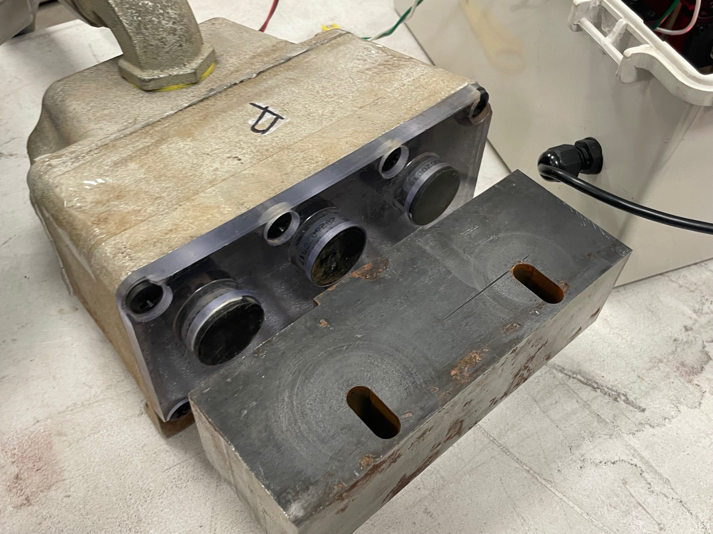

# Switch Gap Detector Troubleshooting Manual

## Introduction
This manual is for use by qualified technicians for onsite troubleshooting of the RAR automated switch system. This is not a product manual or schematic. This manual covers only the steps to diagnose issues, and should not be used to repair or modify the Switch Gap Detector.

### Required Equipment
* Multimeter
* 1/8" Flat head screwdriver
* Personal protective equipment

### Safety Information
* Read all instructions before troubleshooting
* Disconnect power before servicing
* Use personal protective equipment as needed

## Troubleshooting
1. Verify that the device is connected to a working power source

2. Visually inspect the status light
    *  Green : No gap detected
    *  Red : Gap detected

3. Visually inspect the switch
    * Check switch tip for gap, verify that status light matches observed condition
    * Look for obstructions or wear that may be causing damage
    * If observed switch condition conflicts with status light, or gap is too large, refer to [Calibration Issues](#calibration-issues)

4. Test device
    * Throw switch while observing status light
    * Verify that status light is  Green  when switch is in either thrown position, and  Red  while moving
    * Verify that switch gap is within acceptable tolerance

    {: style="height:350px;width:350px"}

### Calibration

* Hold both buttons to enter calibration mode
* Maximum gap distance is ``13.75mm``, sensors will not read further
