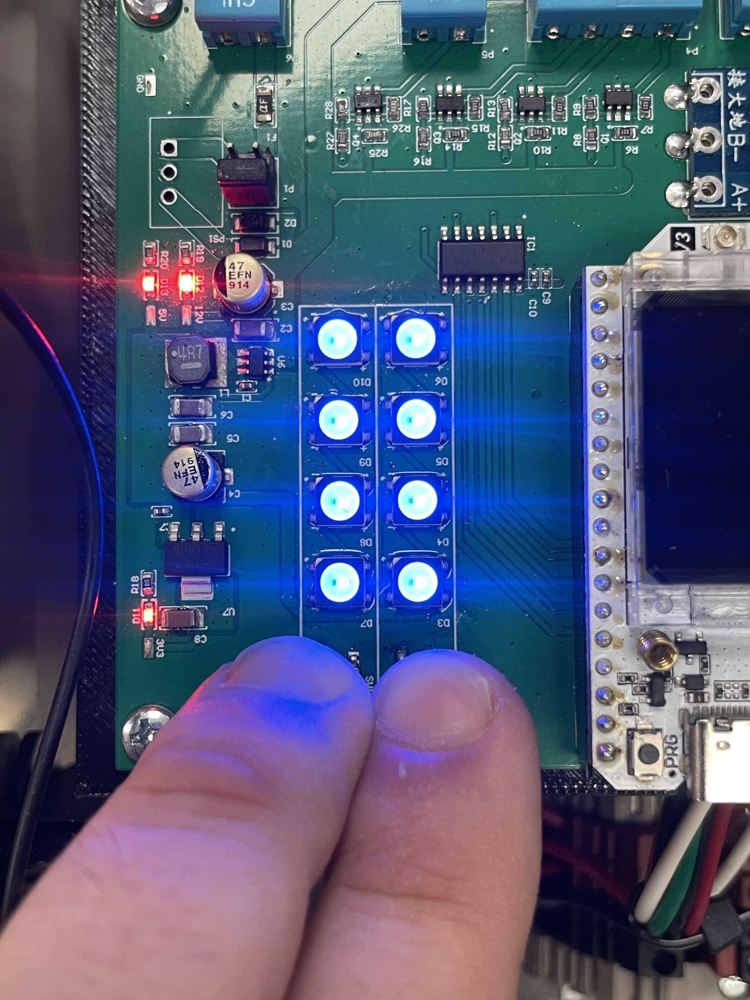

## 3.1 Setup

### Preparation

> ⚠️ Ensure proper PPE is equipped and all required tools are present before attempting to install the Switch Gap Detector. 

### Installing the Sensor Module

> Note: Limited installation instructions are provided. Controller, target plate mounting arm, and protective cover plates are installed by TXRX

1. Start by installing the sensor module on the near side stock rail, closest to the controller enclosure
2. Observe that the sensor module is properly connected to the controller enclosure
3. Ensure the switch is thrown in the direction opposite the stock rail to which the sensor will be mounted
4. Loosen the bolts on the toe clamp located on the top of the sensor housing
5. Fit the toe clamp over the base of the stock rail, parallel with the target plate bracket
6. Tighten the toe clamp bolts so that the sensor is securely fastened to the base of the rail
7. Repeat for the far side stock rail

### Installing the Target Plate

> ⚠️ To prevent damage to the system, take caution not to hit the sensor module with the target plate while installing.

1. Locate the target plate mounting arm with two bolt holes, welded to the switch rail
2. Without fully tightening, use the provided bolts to fasten the target plate to the arm
3. Ensure the target plate is parallel to the sensor module
4. Slide the target plate as far away from the sensor module as possible using the slotted bolt holes
5. Slowly move the switch, bringing the target plate closer to the sensor module
6. Move the target plate if necessary to prevent it from touching the sensor
7. Repeat for the far side switch rail
8. Without tightening the target plate bolts, proceed to calibration

---

## 3.2 Calibration

### Setting the Gap Offset

1. With the switch in position and the sensor module and target plate parallel, place a ``1mm`` shim in between
2. Slide the target plate towards the sensor module until they are only separated by the thickness of the shim
3. Tighten the target plate bolts and remove the shim
4. There should be a 1mm gap between the sensor module and plate when the switch is fully closed, this prevents damage from impact

### Calibrating the Sensor

{: style="height:350px;width:350px"}

1. Ensure both the sensor module and target plate are properly mounted according to the previous steps
2. Open the controller enclosure cover
3. Locate the two push buttons below the LED array
4. Press and hold both buttons simultaneously for ``2 seconds`` until all 8 LEDs blink blue
5. The sensor is now in calibration mode, the status light will shine continuously to assist in programming
6. Moving the switch from side to side, use the on-board LEDs to check that all sensors are detecting the target plates
7. Move the switch to the maximum allowable gapped distance from the near side

> The sensor's maximum detection range is ``13.75 mm``

8. Press and hold both push buttons for ``5 seconds`` until LEDs blink blue
9. The near side gap is now calibrated, repeat the process for the far side

---

## 3.3 Usage

The status light provides visual feedback whether the switch is gapped when not moving. Check the status light after every switch movement to effectively prevent derailments due to gapped switches

* A red blinking light indicates a gap or moving switch
* A green blinking light indicates proper contact

> ⚠️ If the switch is not moving and not intentionally gapped, but the light is blinking ``red``, immediately stop use of the switch until properly inspected.
